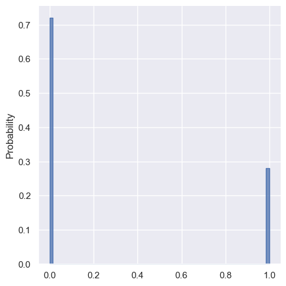

# STAPPL: STAtically typed Probabilistic Programming Language

STAPPL is a compiler for the STAtically typed Probabilistic Programming Language.

## How to Use

Install the necessary OCaml packages:

```sh
opam install . --deps-only
```

You can run the program using the following command:

```sh
dune exec -- stappl <program.stp>
```

This will parse and compile the program, perform inference, and save the distribution plot of the final query variable as a PNG image file.

## Example

Here's an example program and its components:

### Input Program

```ocaml
# student.stp
fun determine_grade(difficult, smart) {
  if difficult & smart then 0.8
    else if difficult & !smart then 0.3
    else if !difficult & smart then 0.95
    else 0.5
}

let difficult = sample(bernoulli(0.4)) in
let smart = sample(bernoulli(0.3)) in
let grade = bernoulli(determine_grade(difficult, smart)) in
let sat = bernoulli(
  if smart then 0.94 +. 0.01  # partial evaluate to 0.95
    else 0.2
) in
observe(grade, false);
observe(sat, true);
smart
```

#### Pretty Print (-pp)

```scheme
((funs
  (((name determine_grade) (params (difficult smart))
    (body
     (If (And (Var difficult) (Var smart)) (Real 0.8)
      (If (And (Var difficult) (Not (Var smart))) (Real 0.3)
       (If (And (Not (Var difficult)) (Var smart)) (Real 0.95) (Real 0.5))))))))
 (exp
  (Assign difficult (Sample (Call bernoulli ((Real 0.4))))
   (Assign smart (Sample (Call bernoulli ((Real 0.3))))
    (Assign grade
     (Call bernoulli ((Call determine_grade ((Var difficult) (Var smart)))))
     (Assign sat
      (Call bernoulli
       ((If (Var smart) (Radd (Real 0.94) (Real 0.01)) (Real 0.2))))
      (Seq (Observe (Var grade) (Bool false))
       (Seq (Observe (Var sat) (Bool true)) (Var smart)))))))))
```

#### Graph Mode (-graph)

```scheme
((vertices (X1 X2 X3 X4)) (arcs ((X1 X3) (X2 X3) (X2 X4)))
 (pmdf_map
  ((X1 (Call bernoulli ((Value 0.4)))) (X2 (Call bernoulli ((Value 0.3))))
   (X3
    (If (Value true)
     (Call bernoulli
      ((If (Bop && (Value true) (Bop && (Var X1) (Var X2))) (Value 0.8)
        (If
         (Bop && (Bop && (Value true) (Uop not (Bop && (Var X1) (Var X2))))
          (Bop && (Var X1) (Uop ! (Var X2))))
         (Value 0.3)
         (If
          (Bop &&
           (Bop && (Bop && (Value true) (Uop not (Bop && (Var X1) (Var X2))))
            (Uop not (Bop && (Var X1) (Uop ! (Var X2)))))
           (Bop && (Uop ! (Var X1)) (Var X2)))
          (Value 0.95) (Value 0.5))))))
     (Value 1)))
   (X4
    (If (Value true)
     (Call bernoulli
      ((If (Bop && (Value true) (Var X2)) (Value 0.95) (Value 0.2))))
     (Value 1)))))
 (obs_map ((X3 (Value false)) (X4 (Value true)))))
```

#### Inference Mode



## License

STAPPL is available under the MIT license. See the [LICENSE](LICENSE) file for more info.
